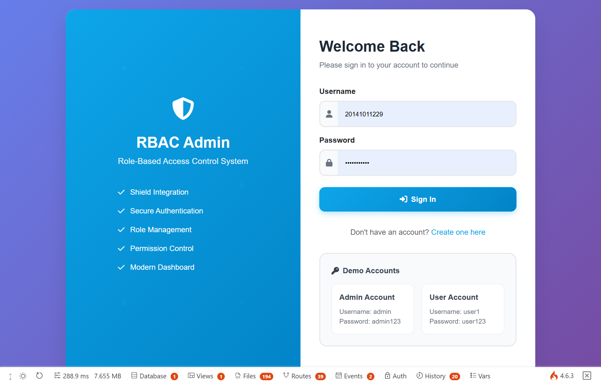

## Donasi ❤

Klik link dibawah untuk mendukung pengembangan

[](https://trakteer.id/mdestafadilah/tip)
[](https://saweria.co/mdestafadilah)

# CodeIgniter 4 RBAC Boilerplate


# Login Page



## Deskripsi Produk

Ini adalah **boilerplate aplikasi web** yang dibangun menggunakan **CodeIgniter 4.7.2**, framework PHP yang ringan dan cepat. Produk ini dirancang khusus untuk mempermudah mahasiswa dalam menyelesaikan tugas akhir mereka, sehingga mereka bisa fokus pada pengembangan fitur inti, bukan pada konfigurasi dasar.

## 🚀 Fitur-fitur Utama

### 1. **Arsitektur Modern dengan Struktur Folder yang Lebih Rapi**

- CodeIgniter 4 menggunakan struktur folder yang lebih terorganisir
- Semua kode aplikasi berada di dalam folder `app/`
- File statis (CSS, JS, gambar) dipindahkan ke folder `public/`
- Membuat aplikasi lebih aman dan alur kerja pengembang jadi lebih jelas

### 2. **Autentikasi Pengguna yang Kuat dan Fleksibel**

Boilerplate ini sudah dilengkapi dengan sistem autentikasi yang aman dan siap pakai:

- ✅ **Login & Registrasi**: Fungsi dasar untuk pendaftaran akun dan login oleh shield
- ✅ **Proteksi Halaman**: Menggunakan Filters untuk melindungi routes atau controller tertentu
- ✅ **Session Management**: Mengelola sesi pengguna dengan cara yang aman dan efisien
- ✅ **Role-Based Access Control (RBAC)**: Sistem role admin dan user

### 3. **Database Migration dan Seeding**

Fitur unggulan dari CI4 yang membantu dalam pengemban database:

- ✅ **Migrations**: Membuat dan mengubah struktur tabel database
- ✅ **Seeders**: Mengisi data awal (sample data) ke dalam tabel
- ✅ **CLI Commands**: Menjalankan perintah dengan `php spark`

### 4. **CRUD (Create, Read, Update, Delete) Data Mahasiswa**

- ✅ Modul CRUD lengkap sebagai contoh implementasi
- ✅ Menggunakan Model bawaan CI4 untuk berinteraksi dengan database
- ✅ Validasi data terintegrasi
- ✅ Flash messages untuk feedback user

### 5. **Desain Responsif dengan Bootstrap 5**

- ✅ Terintegrasi dengan Bootstrap 5
- ✅ Desain yang bersih, modern, dan responsif
- ✅ View layouts untuk elemen yang bisa dipakai ulang
- ✅ Font Awesome icons
- ✅ Dashboard yang informatif

### 6. **Tools Pengembangan yang Lengkap**

- ✅ **Debugging Toolbar**: Toolbar bawaan CI4 untuk debugging
- ✅ **Spark Commands**: Server lokal dengan `php spark serve`
- ✅ **Error Handling**: Penanganan error yang baik
- ✅ **Development Environment**: Konfigurasi mudah untuk development

## 🛠️ Instalasi

### Prasyarat

- PHP 8.1 atau lebih tinggi
- Composer
- PostgreSQL
- Web server (Apache/Nginx) atau gunakan built-in server

### Langkah Instalasi

1. **Clone repository**

   ```bash
   git clone https://github.com/mdestafadilah/codeigniter4-rbac-shield.git
   cd codeigniter4-rbac-shield
   ```

2. **Install dependencies**

   ```bash
   composer install
   ```

3. **Konfigurasi environment**

   ```bash
   cp env .env
   ```

   Edit file `.env` dan sesuaikan konfigurasi database untuk PostgreSQL:

   ```
   database.default.hostname = 127.0.0.1
   database.default.database = nama_database
   database.default.username = username_db
   database.default.password = password_db
   database.default.DBDriver = Postgre
   database.default.port     = 5432
   database.default.charset  = utf8
   ```

4. **Buat database dan jalankan migrations**

   ```bash
   // All Migration!
   php spark migrate
   // If Single File Migration
   php spark migrate:file "app\Database\Migrations\2025-11-19-204424_LogActivity.php"
   ```

5. **Jalankan seeders untuk data contoh**

   ```bash
   php spark db:seed DatabaseSeeder
   ```

6. **Jalankan server**

   ```bash
   php spark serve
   ```

7. **Akses aplikasi**
   Buka browser dan akses: `http://localhost:8080`

8. **Checking Server Production Connection**

   ```bash
   $host = 'localhost';
   $db = 'nama_database';
   $user = 'username_db';
   $pass = 'password_db';
   $port = '5432';

   $db_handle = pg_connect("host={$host} port={$port} dbname={$db} user={$user} password={$pass}");

   if ($db_handle) {
      echo "\nConnection attempt succeeded. \n\n";
   } else {
      echo "\nConnection attempt failed. \n\n";
   }

   echo "Connection Information\n";
   echo "======================\n\n";

   echo "DATABASE NAME:" . pg_dbname($db_handle) . "\n";
   echo "HOSTNAME: " . pg_host($db_handle) . "\n";
   echo "PORT: " . pg_port($db_handle) . "\n\n";
   exit;
   ```

## 👤 Akun Demo

### Admin

- **Username**: `[EMAIL_ADDRESS]`
- **Password**: `admin123`

## 📁 Struktur Proyek

```
app/
├── Controllers/        # Controller files
│   ├── AuthController.php
│   ├── MahasiswaController.php
│   └── Home.php
├── Models/            # Model files
│   ├── UserModel.php
│   └── MahasiswaModel.php
├── Views/             # View files
│   ├── layouts/
│   ├── auth/
│   ├── mahasiswa/
│   └── dashboard.php
├── Database/
│   ├── Migrations/    # Database migrations
│   └── Seeds/         # Database seeders
├── Filters/           # Custom filters
│   └── AuthFilter.php
└── Config/            # Configuration files
    ├── Routes.php
    └── Filters.php
```

## 🎯 Fitur yang Tersedia

### Autentikasi & Autorisasi

- [x] Login dan Logout
- [x] Registrasi user baru
- [x] Session management
- [x] Role-based access control
- [x] Password hashing

## 🚀 Development Commands

```bash
# Menjalankan server development
php spark serve

# Membuat migration baru
php spark make:migration CreateTableName

# Menjalankan migrations
php spark migrate

# Rollback migrations
php spark migrate:rollback

# Membuat seeder
php spark make:seeder SeederName

# Menjalankan seeder
php spark db:seed DatabaseSeeder

# Membuat controller
php spark make:controller ControllerName

# Membuat model
php spark make:model ModelName

# Membuat filter
php spark make:filter FilterName

# Generate Key Secret
php -r 'echo base64_encode(random_bytes(32));'

# Single Migration
php spark migrate:file "app\Database\Migrations\2025-11-19-204424_LogActivity.php"
```

---

## ⚡ Worker Mode (FrankenPHP)

Proyek ini mendukung **Worker Mode** menggunakan **FrankenPHP** untuk meningkatkan performa secara signifikan (30-50% lebih cepat). Worker mode memungkinkan framework hanya melakukan bootstrap satu kali dan menangani banyak request dalam proses yang sama, tanpa perlu memuat ulang seluruh framework setiap request.

### Prasyarat Worker Mode

- **FrankenPHP** - Download dan install dari [frankenphp.dev](https://frankenphp.dev/)
- **PHP 8.2** atau lebih tinggi
- Syarat lainnya sama dengan instalasi standar (Composer, PostgreSQL, dll.)

### Cara Kerja Worker Mode

Worker mode memanfaatkan arsitektur **FrankenPHP** yang merupakan PHP server modern berbasis Caddy. Alurnya:

1. **Bootstrap satu kali**: File `public/frankenphp-worker.php` menjalankan booting framework sekali saat worker pertama kali dijalankan
2. **Persistent services**: Service seperti autoloader, cache, routes tetap bertahan antar request
3. **Request handling**: Setiap request hanya menjalani fase routing, controller, dan view tanpa harus boot ulang
4. **Memory management**: Garbage collection dipaksa setelah setiap request untuk mencegah memory leak

### Konfigurasi Worker Mode

#### 1. **Caddyfile** (Konfigurasi FrankenPHP)

File `Caddyfile` di root proyek mengatur bagaimana FrankenPHP berjalan:

```caddy
{
    frankenphp {
        worker {
            file public/frankenphp-worker.php
            # num 16  # Uncomment untuk mengatur jumlah worker (default: 2x CPU cores)

            # Watch file changes (development only)
            watch app/**/*.php
            watch vendor/**/*.php
            watch .env
        }
    }
    admin off
}

:8080 {
    root * public
    encode zstd br gzip
    php_server {
        try_files {path} frankenphp-worker.php
    }
    file_server
}
```

#### 2. **WorkerMode Config** (`app/Config/WorkerMode.php`)

Konfigurasi worker mode dapat disesuaikan melalui file `app/Config/WorkerMode.php`:

```php
class WorkerMode
{
    // Service yang tetap bertahan antar request
    public array $persistentServices = [
        'autoloader', 'locator', 'exceptions',
        'commands', 'codeigniter', 'superglobals',
        'routes', 'cache',
    ];

    // Event listeners yang di-reset antar request
    public array $resetEventListeners = [];

    // Paksa garbage collection setelah setiap request
    public bool $forceGarbageCollection = true;
}
```

### Menjalankan Worker Mode

#### Untuk Development

1. Pastikan FrankenPHP sudah terinstall dan tersedia di PATH
2. Jalankan perintah berikut dari root proyek:

```bash
frankenphp run
```

3. Akses aplikasi di `http://localhost:8080`

#### Untuk Production (Docker)

Proyek sudah dilengkapi `Dockerfile` dan `docker-compose.yml` untuk deployment production. Namun secara default Dockerfile menggunakan **PHP-FPM + Nginx + Supervisor**, bukan FrankenPHP. Jika ingin menggunakan worker mode di production, sesuaikan Dockerfile untuk menggunakan FrankenPHP.

### Menyesuaikan Jumlah Worker

Jumlah worker secara default ditentukan oleh jumlah CPU cores (2x). Anda bisa mengubahnya di `Caddyfile`:

```caddy
worker {
    file public/frankenphp-worker.php
    num 16  # Set jumlah worker manual
}
```

### Catatan Penting

- **Hot Reload**: Pada mode development, FrankenPHP akan otomatis me-reload worker saat ada perubahan file di `app/`, `vendor/`, atau `.env`
- **PHP 8.2+**: Worker mode membutuhkan **PHP 8.2 atau lebih tinggi** (lebih ketat dari mode standar yang hanya perlu PHP 8.1)
- **Database Reconnection**: Koneksi database secara otomatis di-reconnect setiap request untuk mencegah koneksi stale
- **Garbage Collection**: GC dipaksa berjalan setelah setiap request untuk menjaga penggunaan memori tetap stabil

### Troubleshooting Worker Mode

| Masalah                           | Solusi                                                                                                |
| --------------------------------- | ----------------------------------------------------------------------------------------------------- |
| **Worker crash**                  | Periksa log error FrankenPHP. Pastikan tidak ada kode yang bergantung pada state global antar request |
| **Memory leak**                   | Tambahkan service yang bermasalah ke daftar `resetEventListeners` di `WorkerMode.php`                 |
| **Database connection timeout**   | Pastikan `DatabaseConfig::reconnectForWorkerMode()` dipanggil di worker handler                       |
| **File changes tidak terdeteksi** | Pastikan path pada `watch` di Caddyfile sudah benar                                                   |

---

## 🎨 Kustomisasi

### Menambah Role Baru

1. Update enum di migration `users` table
2. Tambahkan kondisi di `AuthFilter.php`
3. Update validasi di `UserModel.php`

### Menambah Modul CRUD Baru

1. Buat migration untuk tabel baru
2. Buat model dengan validation rules
3. Buat controller dengan method CRUD
4. Buat views untuk UI
5. Tambahkan routes di `Config/Routes.php`

## ⚡ Worker Mode (FrankenPHP)

Worker mode menggunakan **FrankenPHP** untuk meningkatkan performa aplikasi secara signifikan (30-50% atau lebih). Framework hanya di-boot satu kali dan menangani banyak request dalam proses yang sama.

### Prasyarat

- **PHP 8.2+** (minimal)
- **[FrankenPHP](https://frankenphp.dev/)** - install sesuai OS Anda

### Cara Menggunakan

#### 1. Install FrankenPHP

Ikuti petunjuk instalasi di situs resmi [FrankenPHP](https://frankenphp.dev/docs/).

#### 2. Jalankan Aplikasi dengan Worker Mode

```bash
# Gunakan entry point worker untuk menjalankan aplikasi
frankenphp php-server --worker public/frankenphp-worker.php --public-dir public
```

Atau jika menggunakan binary FrankenPHP yang sudah di-download:

```bash
./frankenphp php-server --worker public/frankenphp-worker.php --public-dir public
```

#### 3. Konfigurasi Worker Mode

Sesuaikan konfigurasi di `app/Config/WorkerMode.php`:

```php
// Daftar service yang persist antar request (tidak di-reset)
public array $persistentServices = [
    'autoloader',
    'locator',
    'exceptions',
    'commands',
    'codeigniter',
    'superglobals',
    'routes',
    'cache',
];

// Daftar event listeners yang akan di-reset antar request
public array $resetEventListeners = [];

// Force garbage collection setelah setiap request
public bool $forceGarbageCollection = true;
```

### Cara Kerja

Worker mode bekerja dengan skema sebagai berikut:

1. **Boot satu kali** - Framework diinisialisasi sekali melalui `Boot::bootWorker()`
2. **Loop request** - Setiap request masuk ditangani oleh handler yang sama tanpa menginisialisasi ulang framework
3. **Reset state** - Setelah request selesai, state aplikasi di-reset (koneksi DB, session, services, dll)
4. **GC (Garbage Collection)** - Opsional, membersihkan memory sisa setelah tiap request

### Keuntungan Worker Mode

- ✅ **Performa lebih cepat** - Tidak perlu boot framework ulang untuk setiap request
- ✅ **Penggunaan memory lebih efisien** - Resource dibagi antar request
- ✅ **Cocok untuk production** - Ideal untuk aplikasi dengan traffic tinggi

### Catatan Penting

- Pastikan session di-_close_ setelah request selesai (sudah otomatis di handler)
- Factory dan Services di-reset secara otomatis antar request
- Koneksi database yang memiliki transaksi belum di-_commit_ akan dibersihkan
- Gunakan `$workerConfig->forceGarbageCollection = true` untuk mencegah memory leak

## 🎨 Kustomisasi

### Menambah Role Baru

1. Update enum di migration `users` table
2. Tambahkan kondisi di `AuthFilter.php`
3. Update validasi di `UserModel.php`

### Menambah Modul CRUD Baru

1. Buat migration untuk tabel baru
2. Buat model dengan validation rules
3. Buat controller dengan method CRUD
4. Buat views untuk UI
5. Tambahkan routes di `Config/Routes.php`

## 📝 Database Schema

### Users Table

```sql
- id (INT, PRIMARY KEY, AUTO_INCREMENT)
- username (VARCHAR 100, UNIQUE)
- email (VARCHAR 100, UNIQUE)
- password (VARCHAR 255)
- role (ENUM: 'admin', 'user')
- created_at (DATETIME)
- updated_at (DATETIME)
```

## 🔒 Security Features

- ✅ Shield Powered!
- ✅ Password hashing dengan PHP `password_hash()`
- ✅ Session-based authentication
- ✅ CSRF protection (dapat diaktifkan)
- ✅ Input validation dan sanitization
- ✅ SQL injection protection melalui Query Builder
- ✅ XSS protection dengan `esc()` helper

## 🤝 Kontribusi

1. Fork repository ini
2. Buat branch fitur baru (`git checkout -b feature/AmazingFeature`)
3. Commit perubahan (`git commit -m 'Add some AmazingFeature'`)
4. Push ke branch (`git push origin feature/AmazingFeature`)
5. Buat Pull Request

## 📄 License

Distributed under the MIT License. See `LICENSE` for more information.

## 📞 Support

Jika Anda mengalami masalah atau memiliki pertanyaan:

- 📧 Email: [mdestafadilah@gmail.com](mailto:[mdestafadilah@gmail.com])
- 🐛 Issues: [GitHub Issues](https://github.com/mdestafadilah/codeigniter4-rbac-shield/issues)
- 💬 WhatsApp: [https://wa.me/6283898973731](https://wa.me/6283898973731)

## 🙏 Acknowledgments

- [CodeIgniter 4](https://codeigniter.com/) - The PHP framework
- [Bootstrap 5](https://getbootstrap.com/) - CSS framework
- [Font Awesome](https://fontawesome.com/) - Icons
- [PostgreSQL](https://www.postgresql.org/docs/) - Database PostgreSQL
- [AntiGravity](https://antigravityide.com/) - IDE Editor

---

**Happy Coding! 🚀**

> Developed by [mdestafadilah](https://github.com/mdestafadilah/codeigniter4-rbac-shield)
> Baseon [Muhammad Seman](https://github.com/muhammad-seman/codeigniter4_RBAC_boilerplate)

```

```
